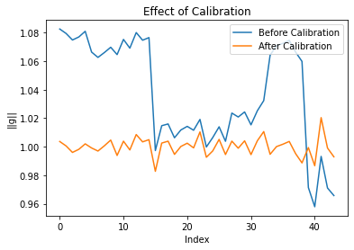

# bayes_cal_paper

## Running on own data (in python)

To see how to use the calibration in R you can have e.g. a look at [R/to_docs/calibration_3D_Glove.qmd](R/to_docs/calibration_3D_Glove.qmd) all results discussed the paper are produced in R. The following example is taken from [python/simple_calibration.ipynb](python/simple_calibration.ipynb)

### Data Collection

When recording, make sure to take data at many different rotations (you don't have to know the exact angle). Try to keep the device still during the recordings. You'll be recording the acceleration and it should look something like this.

``` python
accel = pd.read_csv('../data/IMU2.txt')
accel.head(5)
```

|     | accel_x  | accel_y   | accel_z  |
|:----|:---------|:----------|:---------|
| 0   | 0.018066 | -0.296875 | 1.040894 |
| 1   | 0.016357 | -0.297974 | 1.037354 |
| 2   | 0.015137 | -0.297607 | 1.032715 |
| 3   | 0.018188 | -0.297485 | 1.034912 |
| 4   | 0.015015 | -0.297607 | 1.039062 |

### Calibration

You can run the calibration (ODR approximation) using

``` python
from cmdstanpy import CmdStanModel
dat = {'X' : accel, 'N' : accel.shape[0], 'D' : 3}
inits = {
    's' : [1,1,1],
    'b' : [0,0,0],
    'sigma' : 0.01
}
model = CmdStanModel(stan_file='../stan_models/calibration_ODR.stan')
fit = model.sample(data=dat, iter_warmup=10000, inits=inits)
```

You can then calibrate your readings using

``` python
b_mean = np.array(fit.summary().Mean[1:4])
s_inv = np.array(fit.summary().Mean[5:8])
accel_uncal = np.array(accel)
accel_cal = (accel_uncal - np.array(b_mean)) * s_inv
```

The effect of calibration is visible by looking at

$$
||g|| = \sqrt{a_x^2+a_y^2+a_z^2}
$$ 

before and after calibration. Since the device is not moving it should be close to 1 in all positions, they noise come from our far from perfect recording.



## Reproducting the figures in the paper

Figure 1 (Priors): `R/to_docs/prior.qmd`

Figure 2 (2D Simulation) `R/to_docs/calibration_2D_FullvsODR.qmd`

Figure 3 (3D Simulation) `R/larger_simulation/3D_Simu.R`

Figure 5 (Calibration Sphere) `R/larger_simulation/calibration_3D_Glove.qmd`

Figure 6 (Effect of Calibration) `R/larger_simulation/calibration_3D_Glove.qmd`
